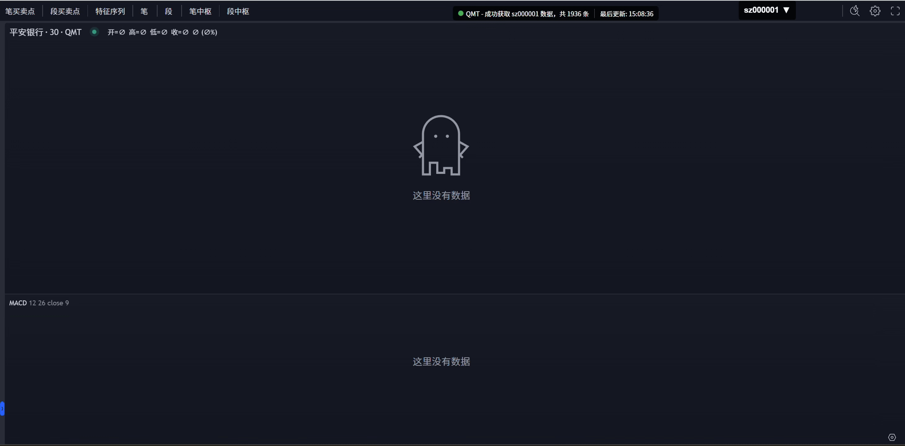

# chuan.py - 缠论分析工具

#### 🌈 项目介绍
* 实现基本 笔 段 中枢 的识别 以及Tradingview前端
* 针对A股进行了修改，可能不再支持BTC的分析，但有能力的可以加上一些条件还是可以继续支持的。
* 增加了股票搜索查询及日期周期的选择。
* 增加了逐K和批量推送的功能开关。
* 增加了多个周期并列观察，及时分析不同周期的信息
* 继续支持实时分析推送
* 主要支持QMT数据获取，如需要其他的数据源，可以参考源码进行改造
* 买卖点的判断目前还无法有效判断，有能力的小伙伴可以一起改进噢！！！
* 本项目源码有完整的注释内容，便于各小伙伴深入理解和改造。

#### 💎 配置方式
安装好依赖，开启QMT极简模式，执行：
```bash
python chan.py
```

#### ⛱️ 预览
逐K推送

修改查询选项启用

批量推送

修改查询选项禁用

多周期并列

http://127.0.0.1:8000/cycle


#### 💌 支持作者
找了好多缠论分析源码，很少有比较完整的，这个项目的原作者已经很久都没有更新过了
于是我在他的基础上进行一些修改，希望可以继续完善好这套系统
如果觉得还不错，也希望帮我点个⭐，谢谢支持。

#### 🙋‍♂️ 关于作者


* 基于开源项目修改：<a target="_blank" href="https://github.com/YuYuKunKun/chanlun.py">YuYuKunKun chanlun</a>
